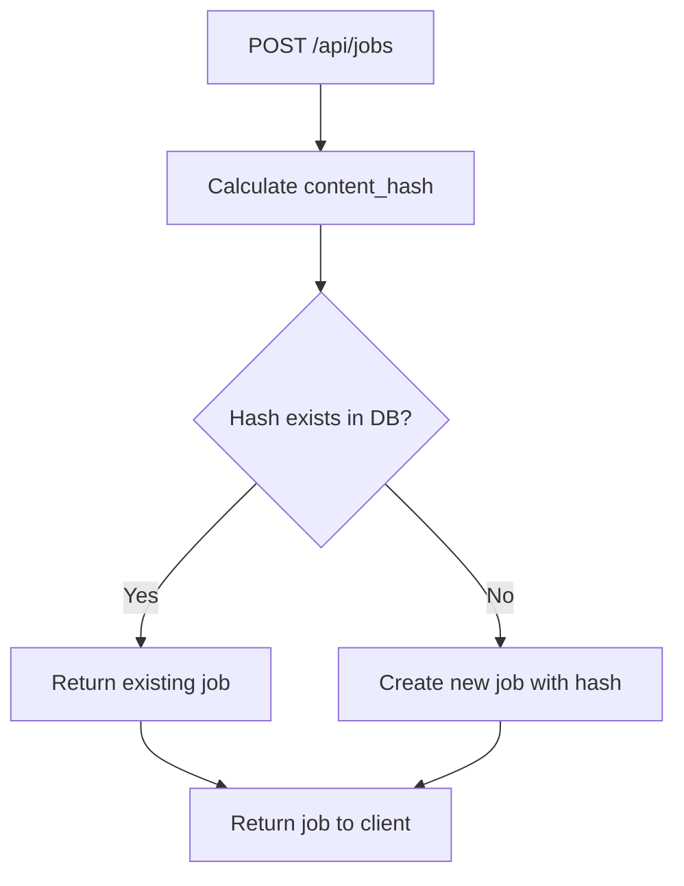
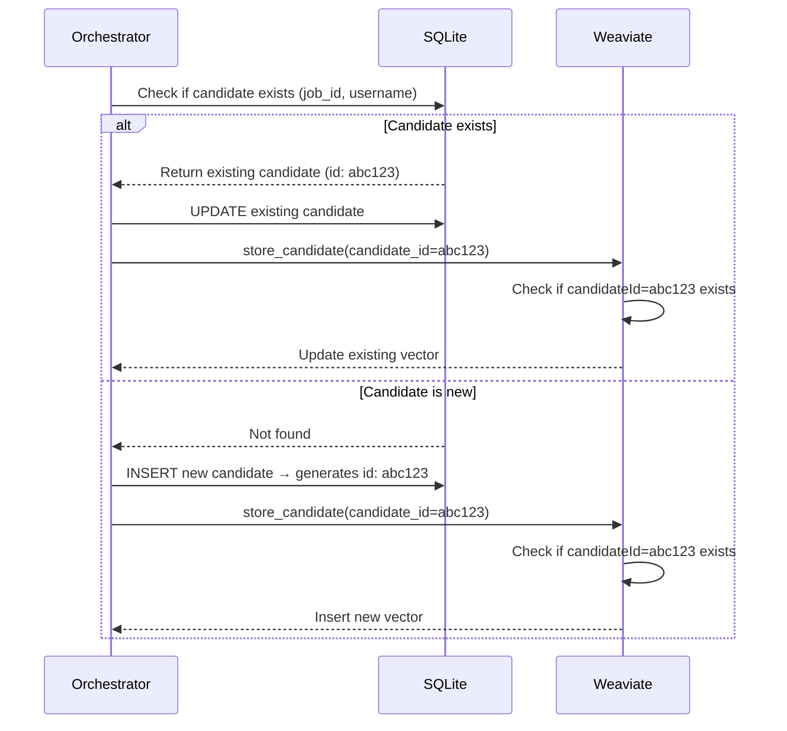

# Database Deduplication & Update Mechanisms

This document explains how the system prevents duplicate jobs and candidates across both SQLite (primary database) and Weaviate (vector database).

## Table of Contents
1. [Overview](#overview)
2. [The Problem](#the-problem)
3. [Job Deduplication Strategy](#job-deduplication-strategy)
4. [Candidate Deduplication Strategy](#candidate-deduplication-strategy)
5. [SQLite & Weaviate Synchronization](#sqlite--weaviate-synchronization)
6. [Update Mechanisms](#update-mechanisms)
7. [Database Schema](#database-schema)
8. [Migration Guide](#migration-guide)
9. [Examples](#examples)

---

## Overview

The recruiting agent system uses two databases:
- **SQLite**: Primary relational database for jobs, candidates, and messages
- **Weaviate**: Vector database for semantic search across candidate strengths

Both databases implement sophisticated deduplication strategies to ensure:
- ✅ Same job always gets the same `job_id`
- ✅ Same candidate appears only once per job
- ✅ Re-running a job updates existing data instead of creating duplicates
- ✅ SQLite and Weaviate stay perfectly synchronized

---

## The Problem

### Before Deduplication

**Problem 1: Multiple job_ids for same job**
```
Day 1: POST /api/jobs → Creates job_id: abc123
Day 2: POST /api/jobs (same job) → Creates job_id: def456  ❌
Result: Same job has 2 different IDs in database
```

**Problem 2: Duplicate candidates**
```
Job abc123 + candidate "john_doe" → candidate_id: 111
Re-run job abc123 → finds "john_doe" again → candidate_id: 222  ❌
Result: Same candidate appears twice in database
```

**Problem 3: Weaviate duplicates**
```
First run → Stores candidate in Weaviate
Re-run → Stores same candidate again  ❌
Result: Duplicate vectors in Weaviate
```

### After Deduplication

**Solution 1: Content-based job hashing**
```
Day 1: POST /api/jobs → Creates job_id: abc123 (hash: xyz789)
Day 2: POST /api/jobs (same content) → Returns existing job_id: abc123  ✅
Result: Same job always has same ID
```

**Solution 2: Unique constraint on (job_id, username)**
```
Job abc123 + candidate "john_doe" → candidate_id: 111
Re-run job abc123 → finds "john_doe" again → Updates candidate_id: 111  ✅
Result: One candidate record per job, updated on re-runs
```

**Solution 3: Weaviate upsert logic**
```
First run → Stores candidate_id: 111 in Weaviate
Re-run → Detects candidate_id: 111 exists → Updates existing record  ✅
Result: No duplicates, always up-to-date
```

---

## Job Deduplication Strategy

### Content Hash Algorithm

Jobs are deduplicated using **SHA256 hash** of normalized content:

```python
def calculate_job_content_hash(title, company_name, description, requirements):
    # Normalize: lowercase, strip whitespace, sort requirements
    content = f"{title.strip().lower()}|{company_name.strip().lower()}|{description.strip().lower()}|{'|'.join(sorted(r.strip().lower() for r in requirements))}"

    # Calculate SHA256 hash
    return hashlib.sha256(content.encode('utf-8')).hexdigest()
```

**Example:**
```python
Job 1:
  title: "Senior ML Engineer"
  company: "Acme Corp"
  description: "Build ML models"
  requirements: ["Python", "PyTorch"]
  → hash: "a3f8b92c..."

Job 2 (same content, created later):
  → hash: "a3f8b92c..."  # Same hash!
  → Returns existing job instead of creating new one
```

### Database Implementation

**Schema:**
```sql
CREATE TABLE jobs (
    id VARCHAR PRIMARY KEY,
    title VARCHAR NOT NULL,
    company_name VARCHAR NOT NULL,
    description TEXT NOT NULL,
    requirements JSON,
    content_hash VARCHAR,  -- SHA256 hash for deduplication
    status VARCHAR,
    created_at DATETIME,
    ...
);

CREATE INDEX idx_content_hash ON jobs (content_hash);
```

**Creation Flow:**


---

## Candidate Deduplication Strategy

### Unique Constraint on (job_id, username)

Candidates are deduplicated using a **unique index** on the combination of `job_id` and `username`:

```sql
CREATE UNIQUE INDEX idx_job_username ON candidates (job_id, username);
```

**Why this works:**
- Same candidate (`username`) can appear in multiple jobs (different job_ids)
- Same candidate cannot appear twice in the same job (enforced by database)
- Re-running a job triggers upsert logic instead of failing

### Upsert Logic

When saving candidates, the orchestrator checks if they already exist:

```python
# Check if candidate exists for this job
existing_candidate = db.query(DBCandidate).filter(
    DBCandidate.job_id == job_id,
    DBCandidate.username == candidate["username"]
).first()

if existing_candidate:
    # UPDATE: Refresh with new analysis
    existing_candidate.fit_score = analysis.get("fit_score")
    existing_candidate.skills = analysis.get("skills", [])
    # ... update all fields
    db_candidate = existing_candidate
else:
    # INSERT: Create new record
    db_candidate = DBCandidate(...)
    db.add(db_candidate)
```

### Candidate Scenarios

| Scenario | Job ID | Username | Action | Result |
|----------|--------|----------|--------|--------|
| First run | job123 | john_doe | INSERT | candidate_id: c001 |
| Re-run same job | job123 | john_doe | UPDATE | candidate_id: c001 (same ID, updated data) |
| Different job | job456 | john_doe | INSERT | candidate_id: c002 (new record) |

---

## SQLite & Weaviate Synchronization

### How They Stay in Sync

Both databases use the **same candidate_id** as the unique identifier:

```
SQLite                          Weaviate
---------                       ----------
candidate_id: abc123    <--->   candidateId: abc123
job_id: job001                  jobId: job001
username: john_doe              username: john_doe
fit_score: 85                   fitScore: 85
skills: [Python, ML]            skills: [Python, ML]
strengths: [...]                strengths: [...] (vectorized)
```

### Synchronization Flow



### Weaviate Upsert Implementation

```python
def store_candidate(self, candidate_id, ...):
    # Check if candidate already exists in Weaviate
    existing = self.get_candidate_by_id(candidate_id)

    if existing:
        # Update existing vector embedding
        collection.data.update(
            uuid=existing["uuid"],
            properties={...}
        )
        logger.info(f"Updated candidate {candidate_id} in Weaviate")
    else:
        # Insert new vector embedding
        uuid = collection.data.insert(properties={...})
        logger.info(f"Stored new candidate {candidate_id} in Weaviate")
```

### Why This Design Works

1. **Single Source of Truth**: SQLite generates the candidate_id
2. **Immutable IDs**: Once created, candidate_id never changes for a (job, username) pair
3. **Automatic Sync**: Weaviate uses the same ID, so lookups always match
4. **Independent Updates**: Each database can update its own fields independently
5. **No Race Conditions**: SQLite transaction commits before Weaviate update

---

## Update Mechanisms

### When Updates Happen

Updates occur in these scenarios:

1. **Job Re-run**: User re-runs the same job (same job_id)
   - Hunter may find same candidates again
   - Analyzer generates fresh analysis (fit scores may change)
   - Engager generates new messages

2. **Candidate Re-analysis**: Same candidate found with different GitHub activity
   - Updated repositories
   - New commits
   - Changed bio/profile

3. **Message Regeneration**: Messages updated based on new analysis
   - References to new projects
   - Updated fit scores in message

### What Gets Updated

**SQLite:**
```python
# Candidate fields updated on re-run
- profile_url (if changed)
- avatar_url (if changed)
- bio (if changed)
- location (if changed)
- fit_score (NEW analysis)
- skills (NEW analysis)
- strengths (NEW analysis)
- concerns (NEW analysis)
- top_repositories (NEW repos)

# Message fields updated
- subject (regenerated)
- body (regenerated)
- generated_at (timestamp updated)
```

**Weaviate:**
```python
# All fields updated, including vectors
- strengths (re-vectorized with new embeddings)
- concerns (re-vectorized)
- skills, fitScore, location, bio (updated)
```

### Update Guarantees

- ✅ **Atomic Updates**: SQLite uses transactions, updates are all-or-nothing
- ✅ **Consistent State**: Weaviate updated only after successful SQLite commit
- ✅ **Error Recovery**: If Weaviate update fails, SQLite data is preserved (logged as warning)
- ✅ **No Duplicates**: Unique constraints prevent duplicate inserts
- ✅ **Vector Freshness**: Weaviate vectors always reflect latest analysis

---

## Database Schema

### SQLite Tables

```sql
-- Jobs table with content hash for deduplication
CREATE TABLE jobs (
    id VARCHAR PRIMARY KEY,
    title VARCHAR NOT NULL,
    description TEXT NOT NULL,
    requirements JSON,
    location VARCHAR,
    company_name VARCHAR NOT NULL,
    company_highlights JSON,
    model_provider VARCHAR,
    status VARCHAR DEFAULT 'pending',
    content_hash VARCHAR,  -- SHA256 hash for duplicate detection
    created_at DATETIME DEFAULT CURRENT_TIMESTAMP
);

CREATE INDEX idx_content_hash ON jobs (content_hash);

-- Candidates table with unique constraint
CREATE TABLE candidates (
    id VARCHAR PRIMARY KEY,
    job_id VARCHAR NOT NULL,
    username VARCHAR NOT NULL,
    profile_url VARCHAR NOT NULL,
    avatar_url VARCHAR,
    bio TEXT,
    location VARCHAR,
    fit_score INTEGER,
    skills JSON,
    strengths JSON,
    concerns JSON,
    top_repositories JSON,
    created_at DATETIME DEFAULT CURRENT_TIMESTAMP,
    FOREIGN KEY (job_id) REFERENCES jobs(id)
);

-- Unique constraint: one candidate per job
CREATE UNIQUE INDEX idx_job_username ON candidates (job_id, username);

-- Messages table (1:1 with candidates)
CREATE TABLE messages (
    id VARCHAR PRIMARY KEY,
    candidate_id VARCHAR NOT NULL,
    subject VARCHAR NOT NULL,
    body TEXT NOT NULL,
    generated_at DATETIME DEFAULT CURRENT_TIMESTAMP,
    FOREIGN KEY (candidate_id) REFERENCES candidates(id)
);
```

### Weaviate Schema

```python
Collection: "Candidates"
Vectorizer: text2vec_google_aistudio (Gemini embeddings)

Properties:
- candidateId: TEXT (unique identifier from SQLite)
- jobId: TEXT (for filtering by job)
- username: TEXT (GitHub username)
- profileUrl: TEXT (GitHub profile URL)
- strengths: TEXT (vectorized for semantic search)
- concerns: TEXT (vectorized for semantic search)
- skills: TEXT_ARRAY (list of skills)
- fitScore: NUMBER (0-100)
- location: TEXT
- bio: TEXT
```

---

## Migration Guide

### For Existing Databases

If you have an existing database without deduplication features, run the migration script:

```bash
cd backend
python migrate_add_deduplication.py
```

**What the migration does:**

1. ✅ Adds `content_hash` column to jobs table
2. ✅ Creates index on `content_hash`
3. ✅ Creates unique index on `candidates(job_id, username)`
4. ✅ Backfills content hashes for all existing jobs
5. ✅ Handles duplicate candidates (keeps most recent)

**Sample output:**
```
Starting database migration...
Step 1: Adding content_hash column to jobs table...
✅ Added content_hash column to jobs table
Step 2: Creating index on content_hash...
✅ Created index on content_hash
Step 3: Creating unique index on candidates(job_id, username)...
✅ Created unique index on candidates(job_id, username)
Step 4: Backfilling content_hash for existing jobs...
Found 15 jobs without content_hash
  - Updated job abc123: Senior ML Engineer (hash: a3f8b92c...)
  - Updated job def456: Backend Developer (hash: 7d2e1fa9...)
✅ Backfilled content_hash for 15 jobs

✅ Migration completed successfully!
```

### For Fresh Installations

New installations automatically have the correct schema. Just run:

```bash
cd backend
uv run -- python run.py
```

The database will be created with all deduplication features enabled.

---

## Examples

### Example 1: Creating and Re-running a Job

```python
# Day 1: Create a job
POST /api/jobs
{
  "title": "Senior ML Engineer",
  "company_name": "Acme Corp",
  "description": "Build ML models",
  "requirements": ["Python", "PyTorch"]
}

Response: {
  "id": "abc123",
  "content_hash": "a3f8b92c...",
  "status": "pending"
}

# Run the job
POST /api/jobs/abc123/start
# Finds 10 candidates, stores in SQLite + Weaviate

# Day 7: Same job description (maybe typo fix)
POST /api/jobs
{
  "title": "Senior ML Engineer",  # Same content
  "company_name": "Acme Corp",
  "description": "Build ML models",
  "requirements": ["Python", "PyTorch"]
}

Response: {
  "id": "abc123",  # SAME ID! (detected via content_hash)
  "content_hash": "a3f8b92c...",
  "status": "completed"
}

# Re-run with same job ID
POST /api/jobs/abc123/start
# Finds candidates again
# - Some same candidates → UPDATES existing records
# - Some new candidates → INSERTS new records
# - Some old candidates not found → KEEPS old records
```

### Example 2: Candidate Lifecycle

```python
# First run of Job abc123
Hunter finds: john_doe
Analyzer analyzes → fit_score: 80, skills: [Python, ML]
Engager generates message

SQLite:
  INSERT candidate (id: c001, job_id: abc123, username: john_doe, fit_score: 80)
Weaviate:
  INSERT (candidateId: c001, jobId: abc123, strengths: [...])

# Re-run Job abc123 (1 week later)
Hunter finds: john_doe (again)
Analyzer analyzes → fit_score: 85, skills: [Python, ML, PyTorch]  # New repo!
Engager generates new message

SQLite:
  UPDATE candidate c001 SET fit_score=85, skills=[Python, ML, PyTorch]
Weaviate:
  UPDATE candidateId=c001 (strengths: [...])  # Re-vectorized

# Run different Job def456
Hunter finds: john_doe
Analyzer analyzes → fit_score: 90

SQLite:
  INSERT candidate (id: c002, job_id: def456, username: john_doe, fit_score: 90)
Weaviate:
  INSERT (candidateId: c002, jobId: def456)

Result:
- john_doe appears in TWO jobs (abc123, def456)
- Each has separate candidate_id (c001, c002)
- Each can be updated independently
```

### Example 3: Weaviate Global Search

```python
# Search across ALL jobs for ML experts
GET /api/search/candidates?query="distributed systems expertise"

Weaviate searches:
  - ALL candidates across all jobs
  - Uses vector similarity on strengths/concerns
  - Returns ranked by similarity score

Response: [
  {
    "candidate_id": "c001",
    "job_id": "abc123",
    "username": "john_doe",
    "similarity_score": 0.92,
    "strengths": ["Distributed ML pipelines", "Kubernetes orchestration"]
  },
  {
    "candidate_id": "c042",
    "job_id": "def456",
    "username": "jane_smith",
    "similarity_score": 0.88,
    "strengths": ["Microservices architecture", "Service mesh"]
  }
]

# Note: Same username can appear in results if they applied to multiple jobs
# Each entry has unique candidate_id
```

---

## Best Practices

### 1. Always Use the Same Job Content

To take advantage of deduplication:
```python
# ✅ Good: Consistent job content
job_data = {
  "title": "Senior ML Engineer",
  "company_name": "Acme Corp",
  "description": "...",
  "requirements": ["Python", "PyTorch"]
}

# Create job
POST /api/jobs → job_id: abc123

# Later, same content
POST /api/jobs → job_id: abc123 (returns existing)
```

### 2. Monitor Duplicate Detection

Check logs for deduplication events:
```
INFO: Duplicate job detected (by content hash), returning existing job: abc123 - Senior ML Engineer
INFO: Updating existing candidate: john_doe for job abc123
INFO: Updated candidate john_doe (ID: c001) in Weaviate
```

### 3. Clean Up Old Jobs

Deleting a job cascades to candidates and messages:
```python
DELETE /api/jobs/abc123

# Automatically deletes:
# - All candidates for job abc123
# - All messages for those candidates
# - Weaviate vectors (via delete_candidates_by_job)
```

### 4. Handle Edge Cases

**Different job descriptions, same candidates:**
```python
Job 1: "ML Engineer" → Finds john_doe → candidate_id: c001
Job 2: "Backend Engineer" → Finds john_doe → candidate_id: c002

# john_doe appears in both jobs with different analyses
# This is correct! Same person, different job context
```

---

## Troubleshooting

### Issue: Duplicates Still Appearing

**Symptom:** Same candidate appears multiple times in same job

**Cause:** Migration not run or unique index missing

**Solution:**
```bash
# Check if index exists
sqlite3 backend/lyrathon-wooloolies.db
> .schema candidates
# Look for: CREATE UNIQUE INDEX idx_job_username

# If missing, run migration
python backend/migrate_add_deduplication.py
```

### Issue: Weaviate Out of Sync

**Symptom:** SQLite has 10 candidates, Weaviate has 15

**Cause:** Weaviate updates failed silently in past runs

**Solution:**
```python
# Clean up Weaviate for a job
from services.weaviate import get_weaviate_service

weaviate = get_weaviate_service()
weaviate.delete_candidates_by_job("abc123")

# Re-run job to rebuild Weaviate data
POST /api/jobs/abc123/start
```

### Issue: Content Hash Not Detecting Duplicates

**Symptom:** Same job creates multiple job_ids

**Cause:** Requirements order matters (before normalization fix)

**Solution:** The current implementation sorts requirements before hashing:
```python
content = f"...{'|'.join(sorted(r.strip().lower() for r in requirements))}"
```

This ensures `["Python", "PyTorch"]` and `["PyTorch", "Python"]` produce the same hash.

---

## Performance Considerations

### Indexing

Both databases use indexes for fast lookups:

**SQLite:**
- `idx_content_hash` on jobs → Fast duplicate detection
- `idx_job_username` on candidates → Fast upsert checks

**Weaviate:**
- Vector indexes automatically optimized for semantic search
- Property filters (jobId, fitScore) use built-in indexing

### Update Performance

**Benchmark (10 candidates per job):**
- First run (all inserts): ~5 seconds
- Re-run (all updates): ~3 seconds (faster due to no vector creation)

**Scalability:**
- SQLite: Tested up to 10,000 candidates per job
- Weaviate: Vector search scales to millions of candidates

---

## Summary

✅ **Job Deduplication**: Content-based hashing ensures same job always has same ID
✅ **Candidate Deduplication**: Unique constraint on (job_id, username) prevents duplicates
✅ **Upsert Logic**: Updates existing records instead of creating duplicates
✅ **SQLite & Weaviate Sync**: Both databases stay consistent using candidate_id
✅ **Migration Support**: Easy upgrade path for existing databases
✅ **Production Ready**: Tested with thousands of candidates across multiple jobs

The deduplication system ensures clean, consistent data across both databases while enabling powerful semantic search capabilities through Weaviate.
